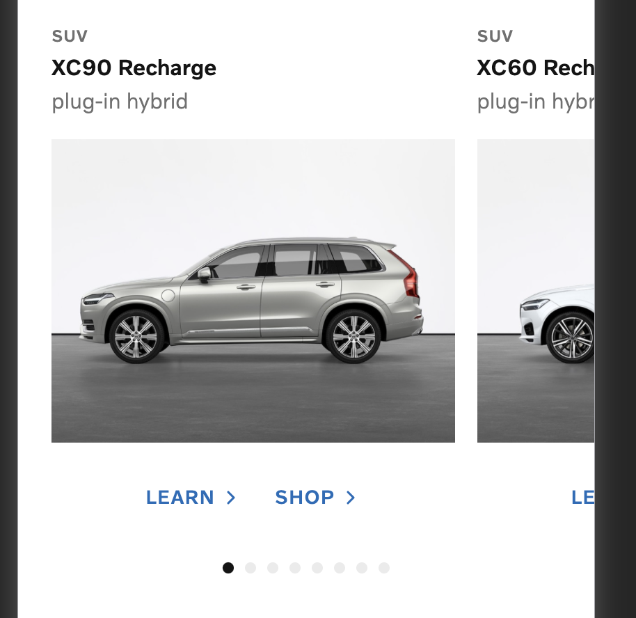

# Personal notes

This is my first time working with the NextJS setup. The approach
is a combination of the best of two worlds (React & React-native).
If I where supposed to do this without 'my' approach I would just go for
a pure web setup and import some npm packages.

This package includes:

- Responsive design for web and mobile according to docs
- Usage of vcc/ui
- Combination and manipulation of vcc/ui together with styled components
- Concatating of data id to new urls shop & learn
- Bonus: Done a few unit tests just for show off under organisms/CardGesture/gestures - optimally I would have done unit tests
  for all functions
- Bonus: Use volvo design system
- Bonus: Filter cars by bodyType
- Negative: Its not purely React its React with a chunk of React native
- Negative: Accessibility can always be better (etc. voice over + extras)

Observations: Reanimated 3.0+ is not mature enough for web together with NextJS. There is some issues using vcc/ui in development when hard refreshing / hot reloading. Suddenly it lacks classNames. Searching for the issue refers to lack of next/babel in babel.config.js but
metro bunder for react native do not work together with next/babel

# Volvo Cars (Global Online Digital)

## Front-end coding test (React)

Our team's designer has come up with a new design to show our latest and greatest recharge cars on the website.

Here is how the design look like for desktop and mobile (files are stored under `docs` folder)

### Desktop


### Mobile



The data required to render the design is under `public/api/cars.json` folder. You need to fetch the data from the client side and render it in the browser. The data looks like this:

```json
[
  {
    "id": "xc90-recharge",
    "modelName": "XC90 Recharge",
    "bodyType": "suv",
    "modelType": "plug-in hybrid",
    "imageUrl": "/images/xc90_recharge.jpg"
  }
]
```

The product owner is telling you that you can generate the links to the learn and shop pages of each car by concatating the `id` of the car to the learn (`/learn/`) and shop (`/shop/`) urls.

Two extra SVG icons are also provided by our designer which are stored under `docs` folder.

## Requirements

- The project is bootstraped using [Next.js](https://nextjs.org/).
- Browser support is modern ever-green browsers.
- Implement this design using React and Typescript.
- Accessibility is important.
- Code Structure and reusablity is important.

## Bonus Points:

- If you use our design system component library, [VCC-UI](https://vcc-ui.vercel.app/)
- If you add a filter bar on the top to filter cars by `bodyType`
